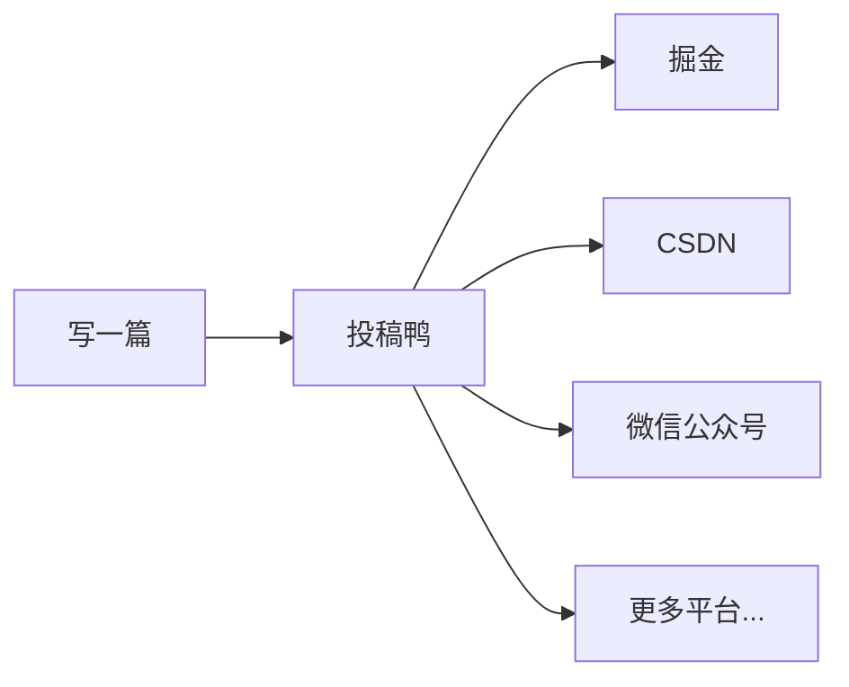
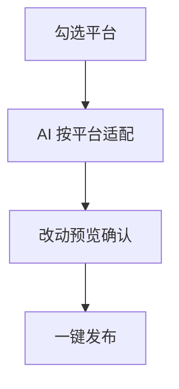
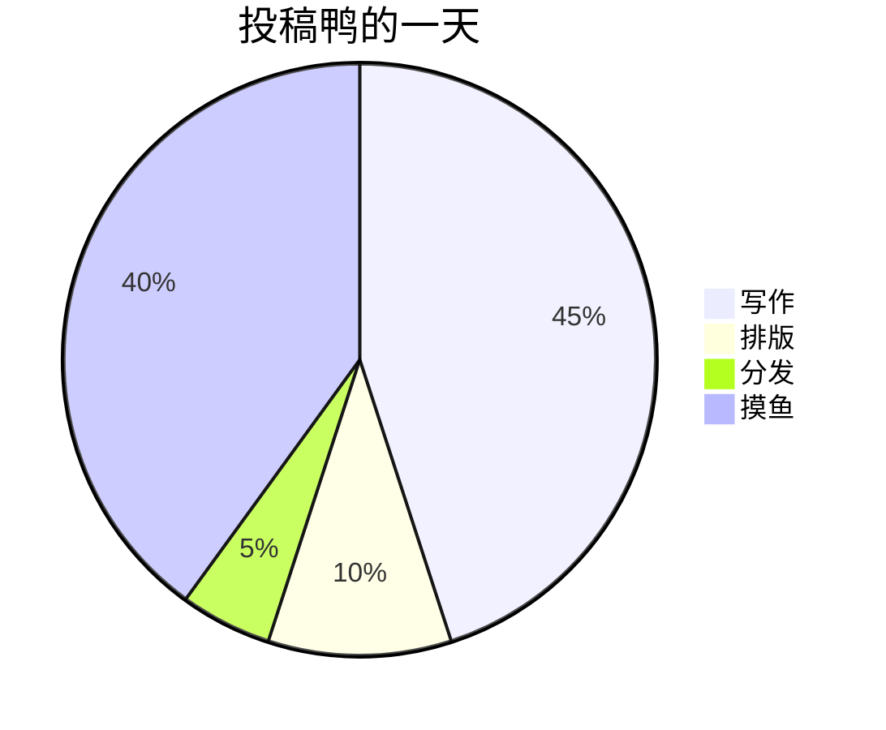
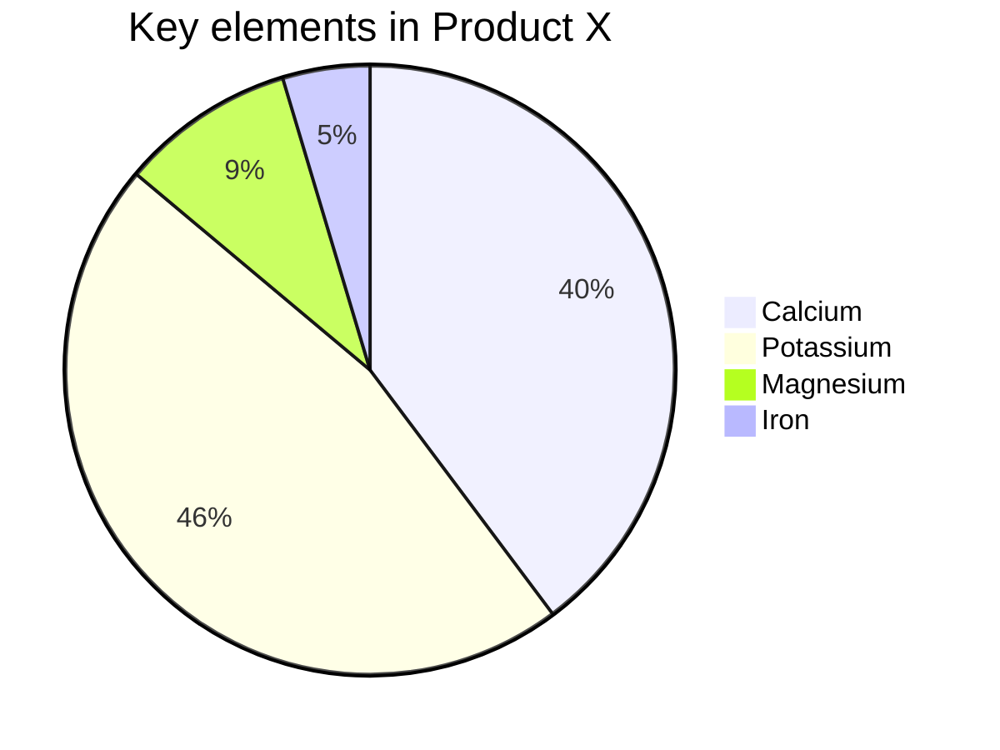
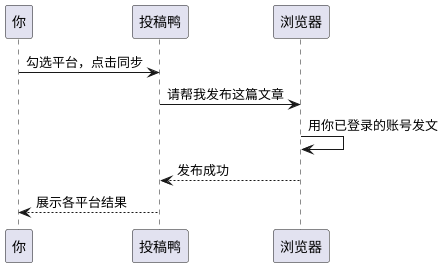

# 探索投稿鸭（TouGaoYa）的奇妙世界

[TOC]

欢迎来到投稿鸭的奇妙世界！无论你是技术博主、内容创作者，还是需要把一篇文章分发到多个平台的写作者，投稿鸭都能成为你的得力助手。它不仅是一个顺手的本地 Markdown 编辑器，更是一个「一次写作、多平台分发」的工作台。

你的文章保存在本地，登录状态由你自己的浏览器持有，投稿鸭只负责帮你把内容整齐地送到每一个平台。既简单，又安心。


> 本文同时也是一篇「语法体验文」：投稿鸭支持的所有 Markdown 语法，都会在文中真实渲染，你可以直接对照源码与预览效果。

## Markdown 基础语法体验

### 1. 标题：让你的内容层次分明

用 `#` 号创建标题，`#` 的数量表示标题级别。本文本身就是最好的示例——从一级标题到四级标题，层次井然有序。

#### 这是一个四级标题

配合文中的 `[TOC]`，长文导航毫不费力。

### 2. 段落与换行：自然流畅

Markdown 中的段落就是一行接一行的文本。

要创建新段落，只需在两行文本之间空一行。就像这样。

### 3. 字体样式：强调你的文字

投稿鸭支持完整的字体样式：

- **粗体**：用两个星号或下划线包裹，如 `**粗体**` 或 `__粗体__`。
- _斜体_：用一个星号或下划线包裹，如 `*斜体*` 或 `_斜体_`。
- ~~删除线~~：用两个波浪线包裹，如 `~~删除线~~`。
- ==高亮==：用两个等号包裹，如 `==高亮==`。
- ++下划线++：用两个加号包裹，如 `++下划线++`。
- ~波浪线~：用一个波浪线包裹，如 `~波浪线~`。

这些标记可以让你的内容更有层次感、重点更突出。

### 4. 列表：整洁有序

- **无序列表**：用 `-`、`*` 或 `+` 加空格开始一行。
- **有序列表**：使用数字加点号（`1.`、`2.`）开始一行。

在列表中嵌套其他内容？只需缩进即可：

- 投稿鸭的核心能力
  1. 本地 Markdown 写作
  2. 多平台一键分发
  3. 工作区云同步
- 数据完全保存在本地

写作流程也很简单：

1. 在工作区写文章
2. 勾选目标平台
3. 一键同步发布

### 5. 链接与图片：丰富内容

- **链接**：`[显示文本](链接地址)`，如 [访问投稿鸭官网](https://tougaoya.com)。
- **图片**：和链接类似，前面加 `!`，如 ``。


> 因微信公众号平台不支持除公众号内容以外的链接，故其他平台的链接，会呈现链接样式但无法点击跳转。

> 对于这些链接请注意明文书写，或点击左上角「格式->微信外链接转底部引用」开启引用，这样就可以在底部观察到链接指向。

另外，使用 `<,>` 语法可以创建横屏滑动幻灯片，支持微信公众号平台。建议使用相似尺寸的图片以获得最佳显示效果：

<,,>

### 6. 引用：引用名言或引人深思的句子

使用 `>` 创建引用；多层引用？在前一层 `>` 后再加一个就行。

> 写一次，到处发布。
>
> > —— 投稿鸭的设计哲学

### 7. 代码块：展示你的代码

- **行内代码**：用反引号包裹，如 `code`。
- **代码块**：用三个反引号包裹并指定语言，语法高亮让代码更易读：

```js
console.log(`Hello, 投稿鸭!`)
```

```python
print("写一次，到处发布")
```

### 8. 分割线：分割内容

用三个或更多的 `-`、`*` 或 `_` 创建分割线，为内容添加视觉分隔。

---

### 9. 表格：清晰展示数据

投稿鸭的功能一览：

| 功能     | 说明                                   |
| -------- | -------------------------------------- |
| 本地写作 | 文章以 Markdown 文件保存在你自己的电脑 |
| 多平台分发 | 一次勾选，同步到 28+ 内容平台        |
| 微信预览 | 一键复制为公众号兼容的排版             |
| 历史版本 | 每篇文章自动保留历史，随时回看恢复     |
| 云同步   | 工作区可绑定云端仓库，多设备协作       |

### 10. 目录：自动生成文档导航

本文开头单独一行的 `[TOC]` 即为自动生成的层级目录。

> 一级标题（`#`）不会出现在目录中，目录锚点根据标题在文档中的位置自动生成。

## 投稿鸭进阶语法体验

### 1. LaTeX 公式：完美展示数学表达式

投稿鸭内置公式渲染，同时支持两种格式：

- **行内公式**：传统格式 $E = mc^2$ 与 LaTeX 标准格式 \(x^2 + y^2 = z^2\) 可以在同一段落中共存。
- **块级公式**：

$$
\chi^2 = \sum \frac{(O - E)^2}{E}
$$

\[
\int_{-\infty}^{\infty} e^{-x^2} dx = \sqrt{\pi}
\]

列表内也可以使用块公式：

1. 编辑模式写公式

$$
a^2 + b^2 = c^2
$$

2. 预览模式看效果

$$
e^{i\pi} + 1 = 0
$$

### 2. Mermaid 流程图：可视化流程

投稿鸭原生渲染 Mermaid，流程图、时序图、饼图都不在话下。

投稿鸭的分发方式：



一次发布的流程：



写作时间分配（示意）：





> 更多用法，参见：[Mermaid User Guide](https://mermaid.js.org/intro/getting-started.html)。

### 3. PlantUML 流程图：可视化流程

PlantUML 同样开箱即用，画个时序图表达一次发布的过程：



> 更多用法，参见：[PlantUML 主页](https://plantuml.com/zh/)。

### 4. Infographic 信息图：可视化数据

新一代信息图可视化引擎，让文字信息栩栩如生：

```infographic
infographic list-row-horizontal-icon-arrow
data
  title 投稿鸭分发流水线
  desc 一次写作 · 多平台触达
  items
    - label 本地写作
      value 1
      desc 顺手的 Markdown 编辑器
      icon rocket-launch
    - label 平台勾选
      value 28
      desc 官方平台即选即用
      icon progress-check
    - label AI 适配
      value 3
      desc 按平台调性改稿
      icon account-sync
    - label 一键分发
      value 99
      desc 真实登录态安全发布
      icon account-group
```

> 更多用法，参见：[AntV Infographic Gallery](https://infographic.antv.vision/gallery)。

### 5. Ruby 注音：注音标注

支持两种格式：`[文字]{注音}` 与 `[文字]^(注音)`。

渲染效果：

[投稿鸭]{tóu gǎo yā} [世界]{shì jiè}

支持四种分隔符：`・`（中点）、`．`（全角句点）、`。`（中文句号）、`-`（英文减号）：

[投稿鸭真好用]{tóu・gǎo・yā・zhēn・hǎo・yòng}
[小夜時雨]^(さ・よ・しぐれ)

当字符串数量与分隔符数量不匹配时，会自动匹配到最合适的分隔符：

[小夜時雨]{さ・よ・しぐれ}
[小夜時雨]{さ・よ}
[小夜]{さ・よ・しぐれ}
[小夜時雨]{さ・よ・しぐれ・extra}

### 6. 警告块与环境：突出重点内容

使用 `> [!类型]` 或 `::: 类型 ... :::` 语法即可创建带样式的警告块。类型后还能跟一个**自定义标题**，正文支持完整的 Markdown 与公式。

> [!NOTE]
> 投稿鸭所有数据都存储在本地，平台登录状态由你自己的浏览器持有。

> [!TIP]
> 编辑器内粘贴图片即可自动上传图床，支持多种主流图床任选。

> [!IMPORTANT] 发布前必读
> 同步前请确认浏览器扩展显示「已连接」，登录状态以你的浏览器为准。

> [!WARNING]
> 部分平台通过自动操作真实网页完成发布，发布过程中请勿手动干预对应标签页。

也可以使用 `:::` 容器语法，效果相同：

::: tip
工作区可以绑定云端仓库做备份与多设备同步，随时可以推送、拉取、查看差异。
:::

还内置了定理、引理、定义等**学术环境**，正文可直接书写公式：

::: theorem 投稿守恒定理
一篇文章的总创作成本守恒：在编辑器里多花的每一分钟排版，都会在分发环节十倍省回来，即 $T_{排版} \ll \sum_{i=1}^{n} T_{平台_i}$。
:::

::: definition
若对任意平台 $p$，文章 $A$ 都能经适配后成功发布，则称 $A$ 是「全网可达」的。
:::

::: proof
勾选目标平台，点击同步。证毕。
:::

类型名称可以是**任意文字**（包括中文），未匹配到内置样式时会使用统一的默认样式，并以名称作为标题：

::: 摸鱼提示
写得快不是本事，发得快才是。
:::

## 结语

Markdown 是一种简单、强大且易于掌握的标记语言，而投稿鸭则把它从「写作工具」升级为「创作流水线」——本地化的数据存储让你完全掌控内容，浏览器扩展让多平台发布既安全又省心，AI 辅助、图床、素材库、云同步这些围绕写作的细节，则让整个过程顺滑自然。

现在，打开投稿鸭，写下你的第一篇文章，然后一键分发到所有平台吧！探索投稿鸭的世界，你会发现写作可以如此自由！

### 推荐阅读

- [投稿鸭官网](https://tougaoya.com)
